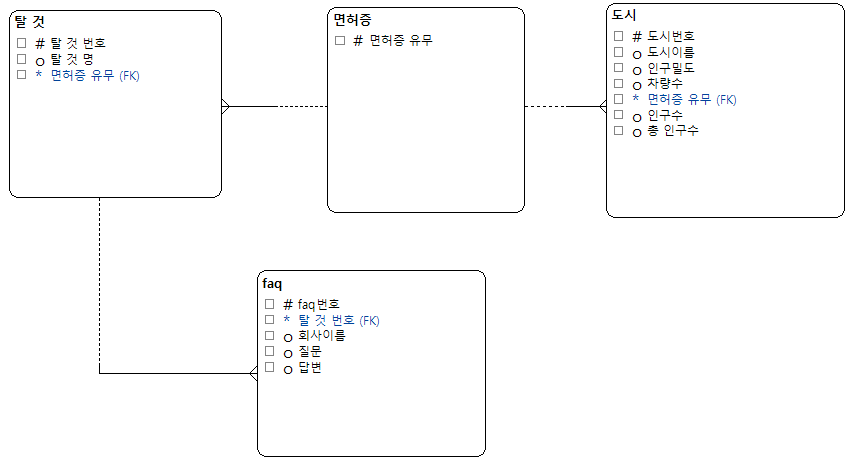

# SKN011-1st-6Team

## 👋🏻NOT(TEMU)조 팀원소개
| 황준호 | 김한솔 | 정현욱 | 오정현 | 이혜성 |
| --- | --- | --- | --- | --- |
|  |  |  |  |  |
| ENTJ | ESFJ | ISTP | ISTP | ISFJ |
---
## 🚙NOT TEMU SHARE 프로젝트

**📅개발기간**

2025.02.25 ~ 2025.02.26 (총2일)

**➕프로젝트 주제**

인구밀도 대비 자동차 보급이 적은 지역을 분석하여 렌트카, 공유 모빌리티 업체에 추가 배치 정보를 제공하는 기업 FAQ 연계 시스템.

---

## 🚙Introduction NOT TEMU SHARE
### 🧑🏻‍🏫프로젝트 소개
본 프로젝트는 전국 자동차 등록 현황과 인구밀도를 분석하여 자동차 보급률이 낮은 지역을 파악하고, 이를 기반으로 렌트카, 공유 킥보드, 공유 자전거, 택시 업체 등에 최적의 추가 배치 정보를 제공하는 시스템입니다. 또한, 해당 업체들의 FAQ를 연계하여 서비스 제공자들에게 적잘한 위차와 이동수단을 지원합니다.

### ✅프로젝트 필요성

1. 교통 인프라 불균형 해소
    - 인구밀도는 높지만 자동차 보급률이 낮은 지역에서는 교통 불편이 발생하며, 이를 해결할 수 있는 대체 이동수단(렌트카, 공유 킥보드, 공유 자전거 등)의 필요성이 증가하고 있습니다.
    
2. 공유 모빌리티 서비스 최적화
    - 공유 모빌리티 기업(따릉이, 쏘카, 지쿠터, 일레클 등)이 효과적으로 차량과 기기를 배치할 수 있도록 데이터를 제공하여 서비스 효율성을 극대화할 수 있습니다.

3. 사용자 접근성 향상
    - 지역별 맞춤형 공유 이동수단 배치를 통해 대중교통과 개인 이동수단의 공백을 최소화하고, 사용자들이 보다 편리하게 이동할 수 있도록 돕습니다.
    
4. 기업과 서비스 제공자 간 정보 격차 해소
    - 관련 기업의 FAQ 데이터를 연계하여 서비스 제공과 관련된 궁금증을 빠르게 해결할 수 있도록 지원하여 최적의 위치에 알맞은 수단을 찾아 줍니다.

### 🎯 프로젝트 목표 

1. 자동차 등록 현황 및 인구밀도 기반 데이터 분석
    - 전국 자동차 등록 현황과 인구밀도를 비교하여 자동차 보급률이 낮은 지역을 도출합니다.
    - 전체인구에서 운전면허 소지자의 수를 뺀 값이 일정 수준 이상인 지역은 렌트카, 공유 킥보드를 일정 수준 이하인 지역은 공유 자건거, 택시를 추천합니다.

2. 최적의 공유 이동수단 배치 정보 제공
    - 분석된 데이터를 기반으로 렌트카, 공유 킥보드, 공유 자전거, 택시 업체 등에 최적의 추가 배치 지역을 추천합니다.

3. FAQ 연계 시스템 구축
    - 공유 모빌리티 서비스(따릉이, 쏘카, 지쿠터, 일레클 등)의 FAQ 데이터를 통합하여 사용자들이 필요한 정보를 쉽게 찾을 수 있도록 지원합니다.

본 프로젝트는 데이터 기반의 분석과 실용적인 정보 제공을 통해 공유 모빌리티 생태계를 더욱 효율적으로 운영할 수 있도록 기여할 것입니다.

---

## 🖥️Tech Stack (기술 스택)

- 개발환경 및 도구

|  |  |  |  |
| --- | --- | --- | ---|

- UI

|  |
| --- |

- 데이터 수집 및 처리

|  |  |  |
| --- | --- | --- | 

--- 

## 🗓️WBS

| 작업 명 | 시작일 | 종료일 | 담당자 | 산출물 | 
| --- | --- | --- | --- |--- | 
| 프로젝트 주제 선정 | 02-25 | 02-25 | ALL | 주제 | 
| 데이터 셋 서치 | 02-25 | 02-25 | ALL | 데이터 셋 | 
| 데이터 정제 및 전처리 계획 | 02-25 | 02-25 | 오정현, 이혜성 | 데이터 셋 | 
| 데이터베이스 설계(ERD) | 02-25 | 02-25 | 황준호, 정현욱 | ERD테이블 | 
| DDL 작성 | 02-25 | 02-25 | 황준호, 정현욱 | DB테이블 |
| DB 저장 코드 구현 | 02-25 | 02-26 | 이혜성 | Python 코드 | 
| 웹 스크래핑 | 02-25 | 02-26 | 오정현, 이혜성 | Python 코드 | 
| streamlit을 통한 GUI 구현 | 02-25 | 02-26 | 김한솔, 정현욱, 황준호 | Python 코드 | 

---

## ERD테이블

---

## 📌한줄회고

**⚾︎황준호⚾︎**

이번 프로젝트를 통해 DB구성(ERD 테이블, DDL문)에 대해서 조금 더 알아가는 시간이 되었습니다.

**🥋김한솔🥋**

배운 내용을 활용해 볼 수 있는 기회를 가져 뜻 깊었습니다. 😁

**🫠정현욱🫠**

우당탕탕후루 프로젝트

**👍오정현👍**

Selenium과 BeautifulSoup을 활용한 웹 크롤링을 경험할 수 있었습니다! 모두 수고 많으셨습니다!

**☄️이혜성☄️**
    
🤔 🤯 😱 🫠 🙂 😎 🤩 🥳

